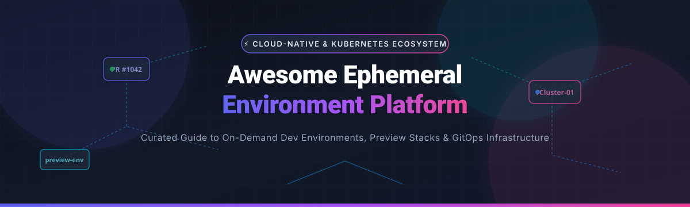

# Awesome Ephemeral Environment Platform ⚡



<p label="badges" align="center">
  <a href="https://github.com/ishandutta2007/Awesome-Awesome-Awesome"></a><a href="https://discord.gg/jc4xtF58Ve"></a>
  &nbsp;&nbsp;•&nbsp;&nbsp;
  <a href="https://github.com/ishandutta2007"></a>
</p>

---

> **Meta Description:** A comprehensive, curated catalog of top SaaS platforms, internal developer platforms (IDP), preview environment tools, and open-source Kubernetes solutions for provisioning on-demand, temporary, and isolated development & QA environments.

### 🚀 Top Ephemeral Environment Platforms Ecosystem

**Curated List of SaaS Products & Open-Source GitHub Projects**  
*Focused on Ephemeral Environments, Preview Environments, Cloud Development Environments (CDE) & On-Demand Development Infrastructure*  
**Last updated: September 2026**

This repository tracks notable **SaaS/hosted platforms** and **open-source projects** for **Ephemeral Environment Platforms**. These tools provision temporary, isolated environments for pull requests, feature branches, development, testing, QA, demos, and CI/CD workflows.

---

## 📑 Table of Contents
- [🌐 Market Size & Industry Structure](#-market-size--industry-structure)
- [🏢 SaaS / Hosted Platforms](#-saas--hosted-platforms)
- [🔓 Open-Source GitHub Projects](#-open-source-github-projects)
- [🏗️ Blueprint Architecture for Self-Hosted Platforms](#%EF%B8%8F-blueprint-architecture-for-self-hosted-platforms)
- [🤝 How to Contribute](#-how-to-contribute)
- [⚠️ Disclaimer](#%EF%B8%8F-disclaimer)
- [📈 Star History](#-star-history)
- [💖 Support & Sponsorship](#-support--sponsorship)

---

## 🌐 Market Size & Industry Structure

The market for **Ephemeral Environments, Cloud Development Environments (CDE), and Internal Developer Platforms (IDP)** is experiencing exponential growth, estimated between **$3.0 Billion and $10.0+ Billion** globally as modern cloud-native practices mature. 

The industry exhibits a **moderately to highly fragmented market structure**. While foundational container orchestration (Kubernetes) and infrastructure-as-code (Terraform/OpenTofu) have converged on dominant standards, developer-facing platforms remain split across specialised niches—ranging from lightweight pull-request preview environments and full-stack Kubernetes isolation (via virtual clusters and mesh sandboxing) to cloud-hosted development workspaces.

---

## 🏢 SaaS / Hosted Platforms

> [!NOTE]
> All SaaS products below are sorted by estimated **Company Size / Valuation / Funding / Market Cap** (descending). Pricing and free tier limits are explicitly detailed per platform.

| Product Name | Description | Starting Price | Free Tier / Free Trial Limits | Company Size / Valuation / Funding / Revenue |
| :--- | :--- | :--- | :--- | :--- |
| **[GitHub Codespaces](https://github.com/features/codespaces)** | Cloud-hosted development environments integrated directly into GitHub repos and workflows. | Paid starting at $0.18/core-hr & $0.07/GB storage/mo | **Free Tier:** 60 hrs/mo of 2-core compute + 15 GB storage free for all personal accounts | Enterprise / Public (Subsidiary of Microsoft, $3.1T+ Market Cap) |
| **[Vercel](https://vercel.com/)** | Frontend cloud platform with instant, automatic deployment previews for Git branches and PRs. | Paid starting at $20/user/mo (Pro Plan) | **Free Tier (Hobby):** Non-commercial use, 100 GB bandwidth, unlimited automatic preview deployments | Enterprise / $3.25B+ Valuation ($313M+ Total Funding, 500+ employees) |
| **[Netlify](https://www.netlify.com/)** | Web development and composable web platform featuring automatic Deploy Previews per pull request. | Paid starting at $19/user/mo (Pro Plan) | **Free Tier (Starter):** 100 GB bandwidth/mo, 300 build minutes/mo, unlimited branch previews | Enterprise / $2.0B Valuation ($212M Total Funding, 400+ employees) |
| **[Codefresh](https://codefresh.io/)** | GitOps and continuous delivery platform with preview environments for Kubernetes (Acquired by Octopus Deploy). | Paid starting at $29/user/mo (Standard Plan) | **Free Tier:** Free for up to 5 users, 1 cluster, unlimited builds | Acquired by Octopus Deploy ($500M+ Valuation, $50M+ ARR, 350+ employees) |
| **[Gitpod](https://www.gitpod.io/)** | Cloud development environment platform provisioning reproducible, isolated dev workspaces on demand. | Paid starting at $0.04/workspace-hr or $9/mo | **Free Trial:** 50 hours/mo or 14-day free trial with 50 credits | Scale-up / $250M+ Valuation ($38M+ Total Funding, 80+ employees) |
| **[Render](https://render.com/)** | Modern cloud platform providing automatic Preview Environments for pull requests and microservices. | Paid starting at $7/mo (Individual compute instance) | **Free Tier:** Free static sites, free web services (512 MB RAM, sleeps on inactivity), 750 pipeline build mins | Mid-stage / $200M+ Valuation ($76M+ Total Funding, 80+ employees) |
| **[Qovery](https://www.qovery.com/)** | Dev platform to deploy apps and auto-create preview & ephemeral environments on AWS/GCP/Azure Kubernetes. | Paid starting at $49/mo (Team Plan) | **Free Tier / Trial:** 14-day free trial with full access; Free tier for up to 2 environments & 3 users | Mid-stage / $150M+ Valuation ($16M+ Funding, 40+ employees) |
| **[Humanitec](https://humanitec.com/)** | Internal developer platform orchestrator for dynamically provisioning application environments & infrastructure. | Paid starting at $15/user/mo or custom consumption | **Free Trial:** 30-day full feature free trial (no credit card required) | Mid-stage / $120M+ Valuation ($34M+ Funding, 60+ employees) |
| **[Port](https://www.getport.io/)** | Internal developer portal orchestrating self-service developer actions and environment provisioning. | Paid starting at $18/service/mo or $450/mo minimum | **Free Tier:** Free forever for up to 5 users and 500 catalog entities | Growth Startup / $100M+ Valuation ($53M+ Total Funding, 70+ employees) |
| **[Coder](https://coder.com/)** | Self-hosted & enterprise dev infrastructure platform provisioning dev environments via IaC templates. | Paid starting at $35/user/mo (Enterprise Edition) | **Free Tier:** Community Edition (OSS) is 100% free with unlimited users | Growth Startup / $100M+ Valuation ($48M+ Total Funding, 60+ employees) |
| **[Okteto](https://www.okteto.com/)** | Kubernetes development platform for spinning up ephemeral preview environments & cloud dev spaces. | Paid starting at $24/user/mo (Scale Plan) | **Free Tier / Trial:** 14-day free trial for Cloud/Self-Hosted Enterprise; OSS tools free | Growth Startup / $60M+ Valuation ($16.5M+ Funding, 40+ employees) |
| **[Railway](https://railway.com/)** | Cloud platform offering instant per-branch isolated deployments and ephemeral dev infrastructure. | Paid starting at $5/mo (Hobby Plan base + usage) | **Free Trial:** $5 one-time execution credit for new users | Fast-growing Startup / $50M+ Valuation ($20M+ Funding, 30+ employees) |
| **[Dagger Cloud](https://dagger.io/)** | Operational dashboard and cloud telemetry platform for programmable containerized CI/CD & environments. | Paid starting at $49/mo (Team Tier) | **Free Tier:** 10,000 free pipeline execution credits per month | Growth Startup / $50M+ Valuation ($30M+ Total Funding, 30+ employees) |
| **[Northflank](https://northflank.com/)** | Developer platform for deploying microservices, databases, jobs, and preview environments. | Paid starting at $6/user/mo + compute resources | **Free Tier:** Free Developer Plan with 2 microservices, 1 database, 1 GB RAM total | Growth Startup / $30M+ Valuation ($7M+ Funding, 25+ employees) |
| **[Signadot](https://www.signadot.com/)** | Kubernetes-native lightweight sandboxing platform for testing microservices & pull requests in isolation. | Paid starting at $250/mo (Team Plan) | **Free Tier:** Free for 1 cluster, up to 5 sandbox environments and 3 team members | Early-stage Startup / $25M+ Valuation ($4M+ Seed Funding, 15+ employees) |
| **[Daytona](https://www.daytona.io/)** | Development environment infrastructure for provisioning isolated, reproducible workspaces securely. | Paid starting at $15/user/mo (Cloud/Managed) | **Free Tier:** Open-source core is 100% free; 14-day free cloud trial | Early-stage Startup / $25M+ Valuation ($5M+ Seed Funding, 20+ employees) |
| **[Uffizzi](https://www.uffizzi.com/)** | Open-source preview-environment platform creating disposable full-stack app environments for PRs. | Paid starting at $10/user/mo (Cloud Managed) | **Free Tier:** Free tier for open-source projects; 30-day free business trial | Early-stage Startup / $20M+ Valuation ($5M+ Funding, 15+ employees) |
| **[ReleaseHub](https://releasehub.com/)** | Environments-as-a-service platform for creating complex, temporary environments for PRs & staging. | Paid starting at $100/mo (Team Tier) | **Free Trial:** 14-day free trial with $500 cloud credits | Early-stage Startup / $20M+ Valuation ($3M+ Funding, 15+ employees) |
| **[DevZero](https://www.devzero.io/)** | Cloud development environment platform delivering production-like, isolated developer workspaces. | Paid starting at $15/user/mo | **Free Tier / Trial:** 14-day free trial with 3 active developer environments | Early-stage Startup / $18M+ Valuation ($5.3M+ Seed Funding, 15+ employees) |
| **[Shipyard](https://www.shipyard.build/)** | Ephemeral environment platform automatically creating on-demand preview environments from Docker Compose. | Paid starting at $19/user/mo (Team Plan) | **Free Tier:** 1 active environment, 30 days history free forever | Early-stage Startup / $15M+ Valuation ($3.8M+ Funding, 12+ employees) |
| **[Garden](https://garden.io/)** | Developer automation platform & Kubernetes orchestrator for ephemeral environments & testing. | Paid starting at $25/user/mo (Enterprise Cloud) | **Free Tier:** Open-source core is 100% free; 14-day free cloud trial | Early-stage Startup / $15M+ Valuation ($4M+ Funding, 15+ employees) |

---

## 🔓 Open-Source GitHub Projects

> [!NOTE]
> Open-source projects below are sorted by **GitHub Stars_Count** (descending) to reflect community adoption.

| Project & Repository | Stars_Count | Description |
| :--- | :--- | :--- |
| **[Kubernetes](https://github.com/kubernetes/kubernetes)** | [](https://github.com/kubernetes/kubernetes/stargazers) | Production-grade container orchestration system serving as the core foundation for ephemeral environment platforms. |
| **[Terraform](https://github.com/hashicorp/terraform)** | [](https://github.com/hashicorp/terraform/stargazers) | Declarative infrastructure-as-code tool used to provision and destroy temporary cloud infrastructure. |
| **[Backstage](https://github.com/backstage/backstage)** | [](https://github.com/backstage/backstage/stargazers) | Open-source developer portal platform created by Spotify for orchestrating self-service environment provisioning. |
| **[Argo CD](https://github.com/argoproj/argo-cd)** | [](https://github.com/argoproj/argo-cd/stargazers) | Declarative GitOps continuous delivery tool for Kubernetes, supporting automated PR preview environments via ApplicationSets. |
| **[LocalStack](https://github.com/localstack/localstack)** | [](https://github.com/localstack/localstack/stargazers) | Fully functional local AWS cloud stack for spinning up disposable local cloud dependency environments. |
| **[Jenkins](https://github.com/jenkinsci/jenkins)** | [](https://github.com/jenkinsci/jenkins/stargazers) | Classic open-source automation server supporting dynamic Kubernetes agent provisioning for temporary pipelines. |
| **[Helm](https://github.com/helm/helm)** | [](https://github.com/helm/helm/stargazers) | The Kubernetes package manager for packaging, instantiating, and tearing down multi-service application releases. |
| **[Testcontainers](https://github.com/testcontainers/testcontainers-java)** | [](https://github.com/testcontainers/testcontainers-java/stargazers) | Lightweight, throwaway instances of databases, message brokers, or web browsers running inside Docker containers for automated tests. |
| **[Act](https://github.com/nektos/act)** | [](https://github.com/nektos/act/stargazers) | Run your GitHub Actions workflows locally inside isolated Docker containers for instant environment iteration. |
| **[Pulumi](https://github.com/pulumi/pulumi)** | [](https://github.com/pulumi/pulumi/stargazers) | Infrastructure-as-code SDK in real programming languages (TS, Python, Go) for programmatically managing ephemeral infrastructure. |
| **[OpenTofu](https://github.com/opentofu/opentofu)** | [](https://github.com/opentofu/opentofu/stargazers) | Open-source, community-driven fork of Terraform for declarative ephemeral environment provisioning. |
| **[Coder](https://github.com/coder/coder)** | [](https://github.com/coder/coder/stargazers) | Open-source remote development platform provisioning cloud dev spaces on your own Kubernetes/VM infrastructure. |
| **[Dagger](https://github.com/dagger/dagger)** | [](https://github.com/dagger/dagger/stargazers) | Programmable CI/CD engine that runs pipelines in isolated, portable containers for deterministic ephemeral builds. |
| **[vCluster](https://github.com/loft-sh/vcluster)** | [](https://github.com/loft-sh/vcluster/stargazers) | Virtual Kubernetes clusters that run inside a single namespace, delivering fully isolated control planes at low cost. |
| **[Nix](https://github.com/NixOS/nix)** | [](https://github.com/NixOS/nix/stargazers) | Powerful package manager providing purely functional, 100% reproducible development and build environments. |
| **[Argo Workflows](https://github.com/argoproj/argo-workflows)** | [](https://github.com/argoproj/argo-workflows/stargazers) | Container-native workflow engine for orchestrating parallel jobs, disposable build steps, and automated tests on Kubernetes. |
| **[Flux CD](https://github.com/fluxcd/flux2)** | [](https://github.com/fluxcd/flux2/stargazers) | Set of continuous delivery solutions for Kubernetes keeping environments in sync with Git repositories. |
| **[DevPod](https://github.com/loft-sh/devpod)** | [](https://github.com/loft-sh/devpod/stargazers) | Open-source, provider-agnostic client to create dev environments based on Dev Containers on any cloud or local setup. |
| **[Daytona](https://github.com/daytonaio/daytona)** | [](https://github.com/daytonaio/daytona/stargazers) | Open-source development environment manager for automatically setting up remote developer workspaces. |
| **[E2B](https://github.com/e2b-dev/E2B)** | [](https://github.com/e2b-dev/E2B/stargazers) | Open-source secure cloud sandboxes for AI agents, code execution, and dynamic temporary runtime environments. |
| **[Minikube](https://github.com/kubernetes/minikube)** | [](https://github.com/kubernetes/minikube/stargazers) | Implements a local Kubernetes cluster on macOS, Linux, and Windows for quick local testing environments. |
| **[Tekton Pipelines](https://github.com/tektoncd/pipeline)** | [](https://github.com/tektoncd/pipeline/stargazers) | Cloud-native, Kubernetes-standard framework for creating continuous integration and deployment pipelines. |
| **[Skaffold](https://github.com/GoogleContainerTools/skaffold)** | [](https://github.com/GoogleContainerTools/skaffold/stargazers) | Handles the workflow for building, pushing, and deploying Kubernetes applications continuously during local dev. |
| **[Earthly](https://github.com/earthly/earthly)** | [](https://github.com/earthly/earthly/stargazers) | Deeply isolated, containerized build automation tool that runs anywhere with consistent execution. |
| **[Crossplane](https://github.com/crossplane/crossplane)** | [](https://github.com/crossplane/crossplane/stargazers) | Open-source Kubernetes control plane framework allowing platform teams to assemble custom environment APIs. |
| **[Tilt](https://github.com/tilt-dev/tilt)** | [](https://github.com/tilt-dev/tilt/stargazers) | Microservice development tool that powers real-time feedback loops for apps deployed to local or remote Kubernetes. |
| **[Kustomize](https://github.com/kubernetes-sigs/kustomize)** | [](https://github.com/kubernetes-sigs/kustomize/stargazers) | Template-free customization of Kubernetes YAML manifests tailored for per-branch ephemeral overlays. |
| **[WireMock](https://github.com/wiremock/wiremock)** | [](https://github.com/wiremock/wiremock/stargazers) | API mock server for creating disposable mock dependency environments during isolated development & testing. |
| **[DevSpace](https://github.com/loft-sh/devspace)** | [](https://github.com/loft-sh/devspace/stargazers) | Client-only developer tool for Kubernetes that automates building, deploying, and debugging cloud applications. |
| **[Kind](https://github.com/kubernetes-sigs/kind)** | [](https://github.com/kubernetes-sigs/kind/stargazers) | Tool for running local Kubernetes clusters using Docker container "nodes", ideal for local/CI ephemeral clusters. |
| **[Porter](https://github.com/porter-dev/porter)** | [](https://github.com/porter-dev/porter/stargazers) | Open-source PaaS running in your own cloud provider with built-in preview environment support. |
| **[Nixpacks](https://github.com/railwayapp/nixpacks)** | [](https://github.com/railwayapp/nixpacks/stargazers) | App source code to runnable OCI image builder powered by Nix, used heavily for instant preview builds. |
| **[Okteto OSS](https://github.com/okteto/okteto)** | [](https://github.com/okteto/okteto/stargazers) | Open-source CLI to develop applications directly inside remote Kubernetes clusters. |
| **[Telepresence](https://github.com/telepresenceio/telepresence)** | [](https://github.com/telepresenceio/telepresence/stargazers) | Fast, local development for Kubernetes microservices by connecting local machine to remote cluster network. |
| **[GitLab Runner](https://github.com/gitlabhq/gitlab-runner)** | [](https://github.com/gitlabhq/gitlab-runner/stargazers) | Runs pipeline jobs in dynamic, ephemeral Docker containers or Kubernetes pods. |
| **[Argo Rollouts](https://github.com/argoproj/argo-rollouts)** | [](https://github.com/argoproj/argo-rollouts/stargazers) | Advanced Kubernetes deployment controller (Canary, Blue-Green) for validating feature branch environments. |
| **[Actions Runner Controller](https://github.com/actions/actions-runner-controller)** | [](https://github.com/actions/actions-runner-controller/stargazers) | Kubernetes operator to scale self-hosted GitHub Actions runners dynamically as auto-scaling ephemeral pods. |
| **[k3d](https://github.com/k3d-io/k3d)** | [](https://github.com/k3d-io/k3d/stargazers) | Lightweight wrapper to run k3s (Rancher's minimal Kubernetes distribution) in Docker for ultra-fast disposable clusters. |
| **[KubeVela](https://github.com/kubevela/kubevela)** | [](https://github.com/kubevela/kubevela/stargazers) | Modern application delivery platform for orchestrating application components and multi-stage environments. |
| **[Mirrord](https://github.com/metalbear-co/mirrord)** | [](https://github.com/metalbear-co/mirrord/stargazers) | Run a local process in the context of your Kubernetes cluster without deploying it, creating virtual sandboxes. |
| **[Plural](https://github.com/useplural/plural)** | [](https://github.com/useplural/plural/stargazers) | Unified application deployment and environment management platform on Kubernetes. |
| **[Cyclops](https://github.com/cyclops-ui/cyclops)** | [](https://github.com/cyclops-ui/cyclops/stargazers) | Developer-friendly Kubernetes UI for managing application templates and ephemeral environment instances. |
| **[Dev Container CLI](https://github.com/devcontainers/cli)** | [](https://github.com/devcontainers/cli/stargazers) | Reference implementation CLI for building and running Development Containers according to specification. |
| **[Loft](https://github.com/loft-sh/loft)** | [](https://github.com/loft-sh/loft/stargazers) | Control plane for self-service virtual clusters, namespace isolation, and auto-sleeping preview environments. |
| **[Karmada](https://github.com/karmada-io/karmada)** | [](https://github.com/karmada-io/karmada/stargazers) | Kubernetes multi-cluster management system allowing seamless deployment of isolated environments across clouds. |
| **[Flagger](https://github.com/fluxcd/flagger)** | [](https://github.com/fluxcd/flagger/stargazers) | Progressive delivery operator automating traffic routing and validation for preview deployments. |
| **[Argo Events](https://github.com/argoproj/argo-events)** | [](https://github.com/argoproj/argo-events/stargazers) | Event-driven dependency manager for Kubernetes triggering dynamic environment creation from Webhooks/Git events. |
| **[Dev Containers Spec](https://github.com/devcontainers/spec)** | [](https://github.com/devcontainers/spec/stargazers) | Open specification defining containerized development environments across IDEs and cloud platforms. |
| **[Prow](https://github.com/kubernetes-sigs/prow)** | [](https://github.com/kubernetes-sigs/prow/stargazers) | Kubernetes-based CI/CD system executing jobs in isolated pod sandboxes for GitHub event automation. |
| **[Kratix](https://github.com/syntasso/kratix)** | [](https://github.com/syntasso/kratix/stargazers) | Framework for building custom Kubernetes-native internal developer platforms and self-service portals. |
| **[KubeSlice](https://github.com/kubeslice/kubeslice)** | [](https://github.com/kubeslice/kubeslice/stargazers) | Creates isolated application network overlays across Kubernetes clusters for multi-tenant environments. |
| **[Shipwright](https://github.com/shipwright-io/build)** | [](https://github.com/shipwright-io/build/stargazers) | Extensible framework for building container images on Kubernetes, a core building block for ephemeral CI. |
| **[Devfile API](https://github.com/devfile/api)** | [](https://github.com/devfile/api/stargazers) | Open specification describing cloud development environments using standardized YAML definitions. |
| **[OpenFeature](https://github.com/open-feature/spec)** | [](https://github.com/open-feature/spec/stargazers) | Vendor-neutral specification for feature flagging, enabling targeted testing inside temporary environments. |
| **[Keptn](https://github.com/keptn/lifecycle-toolkit)** | [](https://github.com/keptn/lifecycle-toolkit/stargazers) | Cloud-native application lifecycle orchestrator validating application health in ephemeral preview environments. |
| **[Coherence](https://github.com/coherence-platform/coherence)** | [](https://github.com/coherence-platform/coherence/stargazers) | Developer platform orchestrating full-lifecycle development, preview, and production environments across AWS/GCP. |
| **[OpenChoreo](https://github.com/wso2/openchoreo)** | [](https://github.com/wso2/openchoreo/stargazers) | Open-source internal developer platform for creating and managing environment workflows on Kubernetes. |

---

## 🏗️ Blueprint Architecture for Self-Hosted Platforms

To assemble a production-grade, self-hosted Ephemeral Environment Platform, engineers typically combine the following stack layers:

```
+-----------------------------------------------------------------------------------+
|                           DEVELOPER WORKFLOW & GITOPS                             |
|         GitHub PR / GitLab MR  -->  Argo CD ApplicationSet / Flux CD              |
+-----------------------------------------------------------------------------------+
                                         |
                                         v
+-----------------------------------------------------------------------------------+
|                        ISOLATION & VIRTUAL CLUSTER LAYER                          |
|             vCluster (Virtual Kubernetes) OR Signadot Mesh Sandboxes              |
+-----------------------------------------------------------------------------------+
                                         |
                                         v
+-----------------------------------------------------------------------------------+
|                         INFRASTRUCTURE PROVISIONING                               |
|        Crossplane Compositions  +  OpenTofu / Terraform  +  Helm / Kustomize        |
+-----------------------------------------------------------------------------------+
                                         |
                                         v
+-----------------------------------------------------------------------------------+
|                         PHYSICAL CLUSTER & DEPENDENCIES                           |
|             Kubernetes Cluster (AWS EKS / GCP GKE / Azure AKS) + LocalStack       |
+-----------------------------------------------------------------------------------+
```

---

## 🤝 How to Contribute

1. Fork the repository.
2. Add or update entries in `README.md` (following the established Markdown table formats).
3. Ensure factual information regarding pricing, free tier limits, Stars_Counts, and company metrics.
4. Submit a Pull Request with a clear description of your additions.

---

## ⚠️ Disclaimer

- This catalog is **community-curated** for educational purposes — not exhaustive and not an explicit commercial endorsement.
- Platform features, pricing models, company valuations, and licensing terms change frequently. Always verify details on official vendor websites.
- Disposable and preview environments can incur significant cloud infrastructure charges if auto-teardown and TTL (time-to-live) policies are omitted.

---

## 📈 Star History

[](https://star-history.dera.page/#ishandutta2007/Awesome-Ephemeral-Environment-Platform&type=date&legend=top-left)

---

## 💖 Support & Sponsorship

If you find this ecosystem catalog helpful for your team, platform engineering journey, or technical research, please consider:

- ⭐ **Starring** this repository to increase visibility.
- 🔀 **Forking** and contributing missing tools or updated pricing data.
- 📢 **Sharing** with your DevOps and platform engineering networks.
- ☕ **Sponsoring** the maintainer on GitHub:

[](https://github.com/sponsors/ishandutta2007)

---

<p align="center">
  <b>Made for platform engineers, DevOps teams, developers, QA engineers, and engineering leaders.</b><br/>
  <i>Let's make ephemeral environments more open, reproducible, automated, and accessible.</i>
</p>
